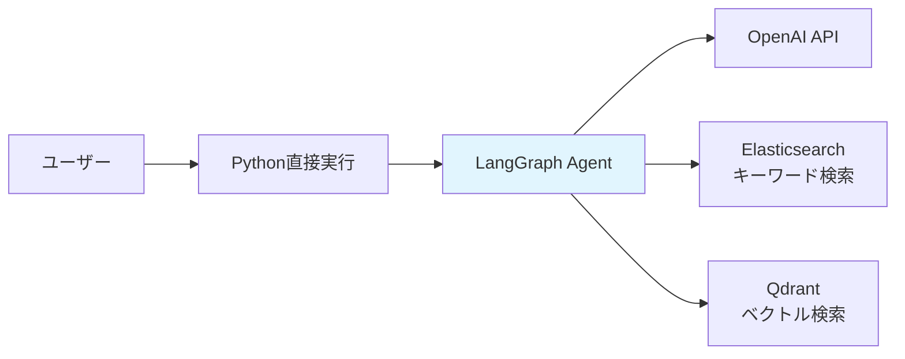
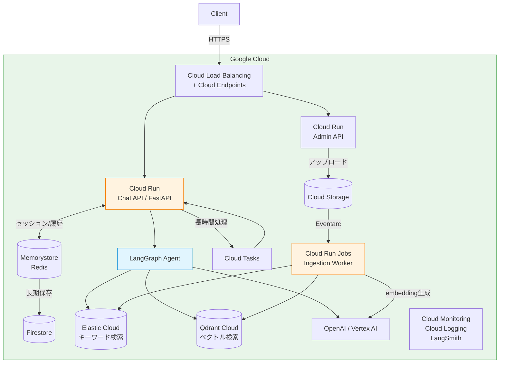
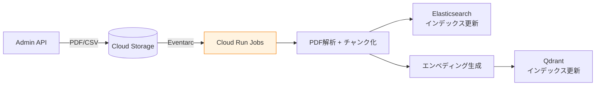
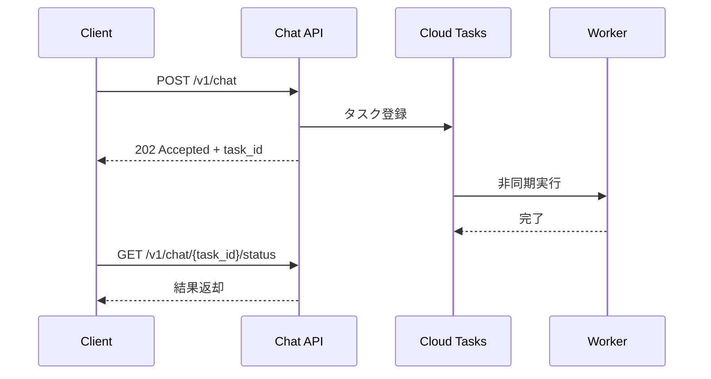
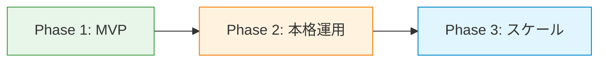

# ヘルプデスクエージェント プロダクションアーキテクチャ設計

## 現在のアーキテクチャ（chapter4）



単一プロセス、Docker Compose、永続化なし、認証なし。

---

## プロダクションアーキテクチャ

### 全体構成図



---

### レイヤー別詳細

#### 1. API Gateway / ロードバランサー

| 項目 | 内容 |
|------|------|
| 役割 | 認証、レート制限、TLS終端、ルーティング |
| 構成 | Cloud Load Balancing + Cloud Endpoints |
| 認証 | API Key or OAuth2/JWT（テナント識別用） |
| レート制限 | テナント/ユーザー単位で制限（LLM APIコスト防御） |

#### 2. Chat API Service（コアサービス）

| 項目 | 内容 |
|------|------|
| フレームワーク | FastAPI + LangServe、または素のFastAPI |
| デプロイ先 | Cloud Run |
| スケーリング | 水平スケール（ステートレス設計、セッションはRedisに外出し） |
| エンドポイント | `POST /chat` (同期) / `POST /chat/stream` (SSE) |

```jsonc
// API設計イメージ
// POST /v1/chat
{
  "session_id": "xxx",        // 会話セッション識別
  "message": "パスワードの文字数制限は？"
}

// Response (streaming SSE):
// data: {"type": "plan", "subtasks": [...]}
// data: {"type": "progress", "subtask": 1, "status": "searching"}
// data: {"type": "answer", "content": "パスワードは8文字以上..."}
```

**重要な設計判断**:
- LangGraphのエージェント処理は数十秒かかるため、**SSE (Server-Sent Events)** でストリーミングが必須
- 長時間リクエストへの対策として、タイムアウトを十分に設定（API Gateway: 30-60s）
- さらに長い処理は非同期化（後述）

#### 3. セッション / 会話履歴管理

| 項目 | 内容 |
|------|------|
| ストア | Memorystore for Redis |
| 保存内容 | 会話履歴、セッションメタデータ |
| TTL | セッション: 30分、履歴: 30日 |
| 永続化 | 長期保存はFirestoreに非同期書き出し |

現在のchapter4は会話履歴を持たない（1ショット）が、プロダクションでは過去の会話を参照して文脈を保持する必要がある。

#### 4. 検索基盤

**Elasticsearch（キーワード検索）**:

| 項目 | 内容 |
|------|------|
| 選択肢 | Elastic Cloud / 自前GKEクラスタ |
| 推奨 | Elastic Cloud（Kuromojiプラグイン標準対応、運用負荷低、GCPリージョンにデプロイ可） |
| 構成 | 本番: 3ノード以上、レプリカ1以上 |
| インデックス戦略 | テナント別インデックス or フィルタ付き共有インデックス |

**Vector DB（ベクトル検索）**:

| 項目 | 内容 |
|------|------|
| 選択肢 | Qdrant Cloud / Pinecone / Weaviate Cloud / pgvector |
| 推奨 | Qdrant Cloud（現行コードとの互換性）or pgvector（運用シンプル） |
| 注意 | エンベディング生成もAPIコールなのでレイテンシに影響 |

#### 5. LLM API

| 項目 | 内容 |
|------|------|
| 選択肢 | OpenAI API / Vertex AI (Gemini) |
| 推奨 | OpenAI API（現行コードとの互換性）、GCP統合重視なら Vertex AI |
| フォールバック | プライマリ障害時にセカンダリモデルへ切り替え |
| コスト管理 | トークン使用量のテナント別計測・制限 |

**注意**: 現在のchapter4は1リクエストで最低5回のLLM呼び出し（プラン1回 + サブタスク×N×(ツール選択+回答+リフレクション) + 最終回答1回）。コストとレイテンシの最大要因。

#### 6. ドキュメントインジェスションパイプライン



| 項目 | 内容 |
|------|------|
| トリガー | GCSイベント（Eventarc） / Admin APIからのキック |
| 実行環境 | Cloud Functions / Cloud Run Jobs |
| 冪等性 | ドキュメントIDベースでupsert |

#### 7. Observability（監視・可観測性）

| レイヤー | ツール | 監視対象 |
|----------|--------|----------|
| LLMトレース | LangSmith / LangFuse | 各ノードの入出力、トークン数、レイテンシ |
| APM | Cloud Trace (OpenTelemetry連携) | API応答時間、エラー率 |
| ログ | Cloud Logging | 構造化ログ（リクエストID紐付け） |
| メトリクス | Cloud Monitoring | RPS、レイテンシp50/p95/p99、LLMコスト |
| アラート | Cloud Monitoring アラートポリシー | エラー率閾値、LLMコスト異常 |

**特にLLMアプリで重要な監視項目**:
- リフレクションループのリトライ回数（品質指標）
- ツール選択の精度（期待通りのツールが選ばれているか）
- 回答品質のフィードバック（ユーザーからの👍👎）

#### 8. 非同期処理（オプション）

エージェント処理が長時間かかるケース（複雑な質問、リトライ多発）に対応:



| 項目 | 内容 |
|------|------|
| キュー | Cloud Tasks + Cloud Run Jobs |
| 用途 | 30秒以上かかるリクエストの非同期化 |

---

### セキュリティ考慮事項

| 項目 | 対策 |
|------|------|
| プロンプトインジェクション | 入力サニタイズ、ガードレールLLM（入力/出力フィルタ） |
| データ漏洩 | テナント分離（検索インデックスのフィルタリング） |
| APIキー管理 | Secret Manager（コードにハードコードしない） |
| PII | ログ・トレースからのPIIマスキング |
| DDoS / 乱用 | Cloud Armor（WAF + DDoS防御） |

---

### コスト構造の目安（月額、小〜中規模）

| コンポーネント | 概算 |
|----------------|------|
| Chat API (Cloud Run) | $50-200 |
| Elasticsearch (Elastic Cloud) | $200-500 |
| Vector DB (Qdrant Cloud) | $100-300 |
| Redis (Memorystore) | $50-150 |
| OpenAI API (最大コスト要因) | $500-5,000+ |
| Observability | $100-300 |
| **合計** | **$1,000-6,000+/月** |

LLM APIコストがドミナント。リクエストあたり5-10回のLLM呼び出しがあるため、トラフィック次第で大きく変動。

---

### 段階的デプロイ戦略



**Phase 1: MVP**
- Cloud Run + Elastic Cloud + Qdrant Cloud + OpenAI API
- 最小構成、手動デプロイ
- LangSmithでトレース

**Phase 2: 本格運用**
- Cloud Build による CI/CD パイプライン
- Memorystore 追加（セッション管理）
- Eventarc によるドキュメントインジェスション自動化
- Cloud Monitoring アラート設定

**Phase 3: スケール**
- Cloud Tasks による非同期処理追加
- マルチテナント対応
- コスト最適化（キャッシュ、モデル切り替え）
- A/Bテスト（プロンプト改善）

---

### GCPサービス対応表

| 役割 | GCPサービス |
|------|-------------|
| コンテナ実行 | Cloud Run（サーバーレス、自動スケール、最小インスタンス設定可） |
| API Gateway | Cloud Endpoints + Cloud Load Balancing |
| セッション | Memorystore for Redis |
| 会話履歴永続化 | Firestore |
| ドキュメント保存 | Cloud Storage (GCS) |
| イベント連携 | Eventarc（GCSアップロード→Ingestion起動） |
| バッチ処理 | Cloud Run Jobs |
| 非同期キュー | Cloud Tasks |
| シークレット | Secret Manager |
| WAF/DDoS | Cloud Armor |
| 監視 | Cloud Monitoring |
| ログ | Cloud Logging |
| トレース | Cloud Trace (OpenTelemetry連携) |
| CI/CD | Cloud Build + Artifact Registry |
| IaC | Terraform |
